<!-- Please do not change this logo with link -->

# Various Solutions for Calculating a Pulse and Duty Cycle

## Related Documentation

- [PIC16F18076 Data Sheet](https://ww1.microchip.com/downloads/aemDocuments/documents/MCU08/ProductDocuments/DataSheets/PIC16F18056-76-28-40-Pin-Microcontroller-Data-Sheet-40002325B.pdf)
- [PIC16F18076 Family Product Page](https://www.microchip.com/wwwproducts/en/PIC16F18076)
- [Various Solutions for Calculating a Pulse and Duty Cycle Application Note](https://www.microchip.com/en-us/application-notes/an3324) <!--UPDATE APP NOTE NUMBER TO WHAT IT SHOULD BE (the new one)-->

## Software Used

- [MPLAB® X IDE](http://www.microchip.com/mplab/mplab-x-ide) **6.0.0** or newer
- [MPLAB Xpress IDE](https://www.microchip.com/en-us/development-tools-tools-and-software/mplab-xpress) (alternative to MPLAB X IDE)
- [MPLAB XC8 Compiler](http://www.microchip.com/mplab/compilers) **2.36** or a newer compiler 
- [Microchip PIC16F1xxxx Series Device Support pack](https://packs.download.microchip.com/) **1.15.191** or newer Device Pack

## Hardware Used

- PIC16F18076 Curiosity Nano [(DM182029)](https://www.microchip.com/en-us/development-tool/EV53Z50A) (x2)

## Introduction
Many times is it desirable to quantify the pulse width of a periodic signal, such as a servo motor, or duty cycle of a pulse-width modulated signal. This code example demonstrates six different methods for measuring a pulse and a period and calculating the duty cycle based off that measured pulse and period all while using the PIC16F18076. 

## Setup
### Hardware Connections

Connect two PIC16F18076 Curiousity Nano boards together following the diagram in Figure 1.

*Figure 1 - Building the Circuit*

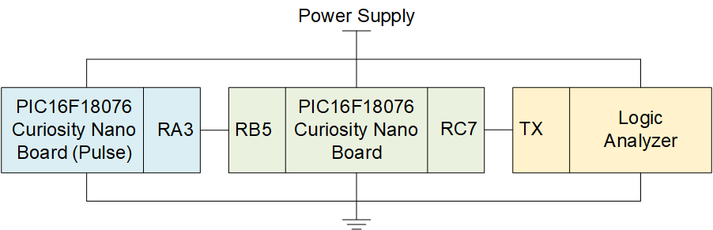

Make sure to connect the UART pin to a logic analyzer so that the results can be viewed.

### Programming
- Download, install, and open MPLABX IDE version 6.0.0 (or newer).

- Download and install the XC8 C-Compiler version 2.36 (or newer).

- Download and Open the 'pic16f18076-calculating-pulse-and-duty-cycle-mplab-melody.X' project as shown in Figure 2.

*Figure 2 - Open Project Menu in MPLABX*

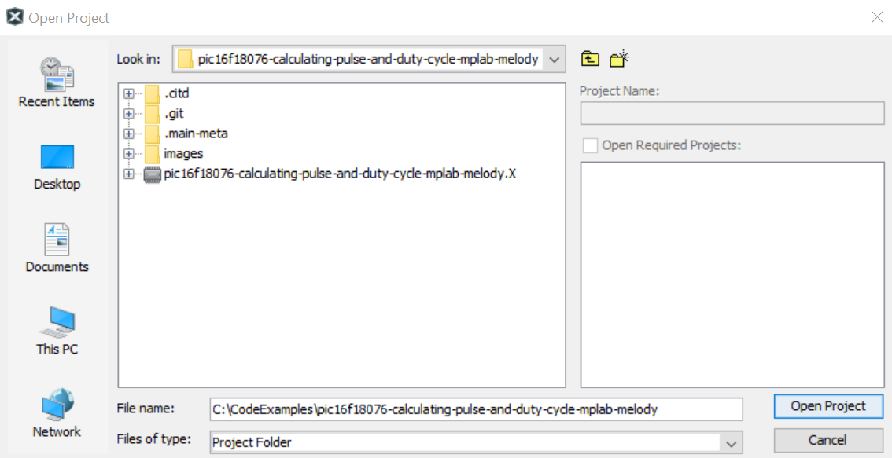

Once the project is open, select either the 'free' or 'pro' configuration as shown in Figure 3.

*Figure 3 - Select project configuration*

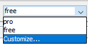

Program the device by clicking on the "Make and Program Device Main Project" from the taskbar at the top (Figure 4).

*Figure 4 -  Make and Program Device Main Project Button*

Wait for the Output tab to show 'Programming Complete' (Figure 5) then proceed to the **Operation** section below.

*Figure 5 -  Programming Complete*

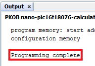

## Operation

This example uses the button (SW0) to toggle between the various methods of measuring the pulse width and duty cycle (Figure 6). 

*Figure 6 -  PIC16F18076 Curiousity Nano Board SW0 Button*

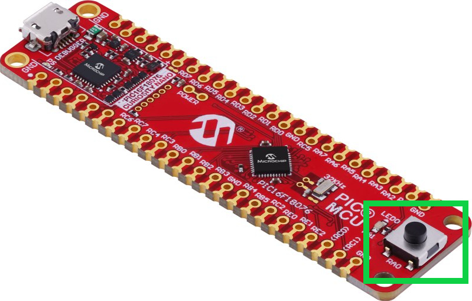

When the button is pressed, it changes the method of measurement following the order of the list below (after #9 is starts over at #1). 

1. Pulse Generator
2. Timer1 Gate
3. CLC NCO 1
4. CLC NCO 2
5. CLC NCO 3
6. CCP
7. Interrupt-On-Change(IOC) with Timer
8. IOC without Timer
9. Polled Input 

### Pulse Generator
The Pulse Generator mode is the default mode for this example.  It generates a 1MHz signal with varying duty cycles. The duty cycles range from 10% to 90% at 10% intervals and constantly loop. This signal will output the pulse to pin RA3.  An example waveform for the pulse generator can be seen in Figure 7. 

*Figure 7 -  Pulse Generator Waveform Example*

<!--add figure-->

### Timer1 Gate
The Timer1 Gate is the first of the measuring methods for this example.  This mode uses only the Timer1 Module to measure the pulse width and duty cycle. The pulse (pin RB5) is measured by having the Timer1 Gate close to connect the Timer1 Clock source to the Timer1 counter when the pulse it high. The period is measured in the same way as the pulse, just the specific interrupt flags change.  The duty cycle is then calculated by taking the pulse and dividing it by the period.  The code outputs an 8-bit value (0-255) which correlates to 0%-100% (i.e. 0x80 or 127 equals 50%). For more details please see the 'Timer1_Gate.c' file. An example waveform for the Timer1 Gate can be seen in Figure 8.

*Figure 8 -  Timer1 Gate Waveform Example*

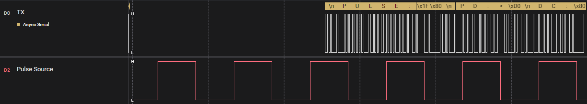

### CLC NCO 
The CLC NCO modules are used in the second, third, and fourth measuring methods for this example.  Each of these methods use either two or three CLC modules, the NCO module, and either the Timer1 module and/or the Timer0 module.  

#### CLC NCO 1
This CLC NCO method uses the CLC1, CLC2, NCO1, and Timer1 modules. The pulse (pin RB5) is measured by the NCO1 module which is clocked by a 4-input AND gate that is configured to CLC1.  The period is measured by starting and stopping Timer1 based on various interrupt flags.  The duty cycle is then calculated by taking the pulse and dividing it by the period.  The code outputs an 8-bit value (0-255) which correlates to 0%-100% (i.e. 0x80 or 127 equals 50%). For more details please see the 'CLC_NCO.c' file. An example waveform for the CLC NCO 1 can be seen in Figure 9.

*Figure 9 -  CLC NCO 1 Waveform Example*

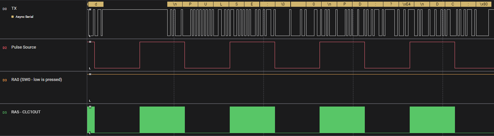

This method has an additional output pin (other than UART) that provides information on the CLC1OUT status.  This signal can be monitored in addition to the other signals by the logic analyzer.

#### CLC NCO 2
This CLC NCO method uses the CLC1, CLC2, CLC3, NCO1, and Timer1 modules. The pulse (pin RB5) is measured by the NCO1 module which is clocked by a 4-input AND gate that is configured to CLC1.  The period is measured by starting and stopping Timer1 based on various interrupt flags.  The duty cycle is then calculated by taking the pulse and dividing it by the period.  The code outputs an 8-bit value (0-255) which correlates to 0%-100% (i.e. 0x80 or 127 equals 50%). For more details please see the 'CLC_NCO.c' file. An example waveform for the CLC NCO 2 can be seen in Figure 10.

*Figure 10 -  CLC NCO 2 Waveform Example*

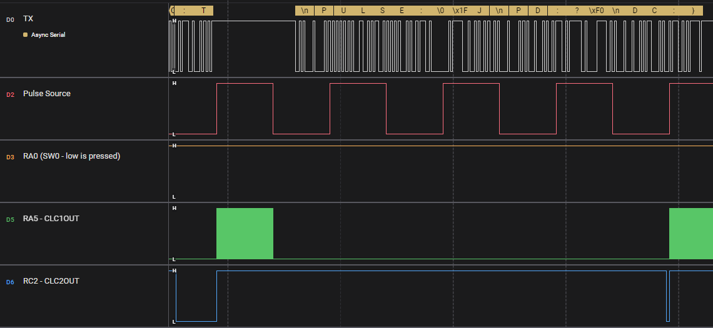

This method has additional output pins (other than UART) that provide information on the CLC1OUT status and the CLC2OUT status.  These signals can be monitored in addition to the other signals by the logic analyzer.

#### CLC NCO 3
This CLC NCO method uses the CLC1, CLC2, CLC3, NCO1, Timer0, and Timer1 modules. The pulse (pin RB5) is measured by the Timer0 module which is clocked by a 4-input AND date that is configured to CLC1.  The period is measured by starting and stopping Timer1 based on various interrupt flags.  The duty cycle is then calculated by taking the pulse and dividing it by the period.  The code outputs an 8-bit value (0-255) which correlates to 0%-100% (i.e. 0x80 or 127 equals 50%). For more details please see the 'CLC_NCO.c' file. An example waveform for the CLC NCO 3 can be seen in Figure 11.

*Figure 11 -  CLC NCO 3 Waveform Example*

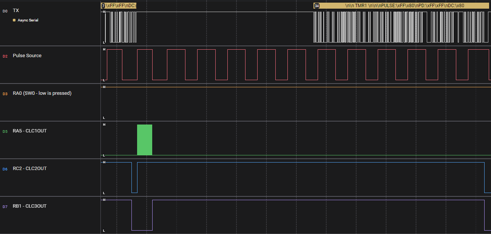

This method has additional output pins (other than UART) that provide information on the CLC1OUT status, CLC2OUT status, and the CLC3OUT status.  These signals can be monitored in addition to the other signals by the logic analyzer.

### CCP
The CCP is the fifth measuring method for this example.  This method uses the CCP1, CCP2, and Timer1 modules to measure the pulse width and duty cycle. The pulse (pin RB5) is measured by using the CCP2 interrupt flag to save two different values (derived from the Timer1 module) and takes the difference between those two values.  The period is measured by using the CCP1 interrupt flag to save two different values (derived from the Timer1 module) and takes the difference between those two values.  The duty cycle is then calculated by taking the pulse and dividing it by the period.  The code outputs an 8-bit value (0-255) which correlates to 0%-100% (i.e. 0x80 or 127 equals 50%). For more details please see the 'CCP.c' file. An example waveform for the CCP method can be seen in Figure 12.

*Figure 12 -  CCP Waveform Example*

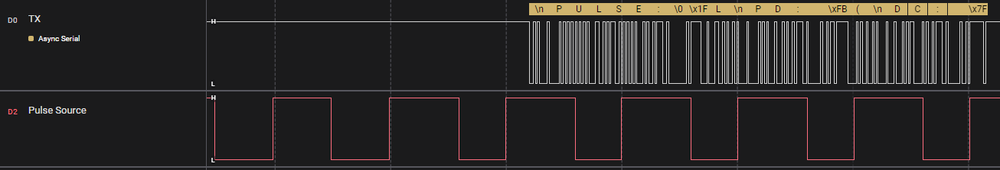

### IOC with Timer
The IOC with Timer is the sixth measuring method for this example.  This method uses the IOC and Timer1 modules to measure the pulse width and duty cycle. The pulse and period (pin RB5) are measured by reading the Timer1 value at various times that are determined by the IOC bit values.  The duty cycle is then calculated by taking the pulse and dividing it by the period.  The code outputs an 8-bit value (0-255) which correlates to 0%-100% (i.e. 0x80 or 127 equals 50%). For more details please see the 'IOC_w_Timer.c' file. An example waveform for the IOC with Timer can be seen in Figure 13.

*Figure 13 -  IOC with Timer Waveform Example*

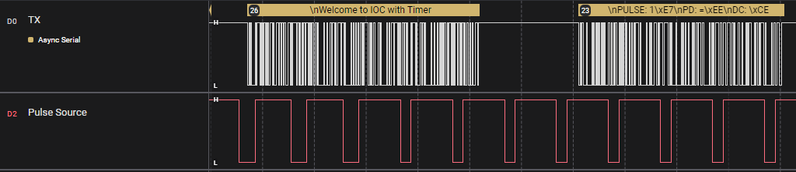

### IOC without Timer
The IOC without Timer is the seventh measuring method for this example.  This method uses the IOC module to measure the pulse width and duty cycle. The pulse and period (pin RB5) are measured by incrementing the pulse or period value depending on the state of the IOC bit values.  The duty cycle is then calculated by taking the pulse and dividing it by the period.  The code outputs an 8-bit value (0-255) which correlates to 0%-100% (i.e. 0x80 or 127 equals 50%). For more details please see the 'IOC_wo_Timer.c' file. An example waveform for the IOC without Timer can be seen in Figure 14.

*Figure 14 -  IOC without Timer Waveform Example*

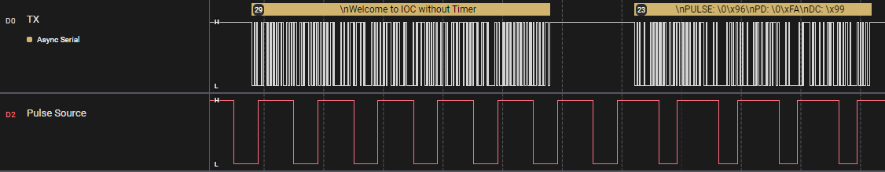

### Polled Input 
The Polled Input is the eighth and final measuring method for this example.  This method does not use any modules, only pin settings, to measure the pulse width and duty cycle. The pulse and period (pin RB5) are measured by incrementing the pulse or period value depending on the state of the input signal pin.  The duty cycle is then calculated by taking the pulse and dividing it by the period.  The code outputs an 8-bit value (0-255) which correlates to 0%-100% (i.e. 0x80 or 127 equals 50%). For more details please see the 'Polled_Input.c' file. An example waveform for the Polled Input can be seen in Figure 15.

*Figure 15 -  Polled Input Waveform Example*

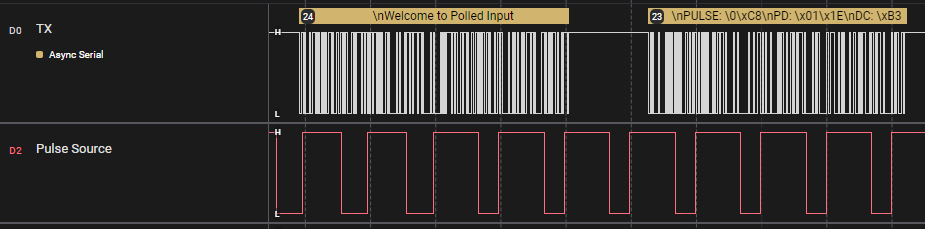

Below is an image that shows what can be seen on a logic analyzer when all the modes are cycled through once.

*Figure 16 - All Button Modes*

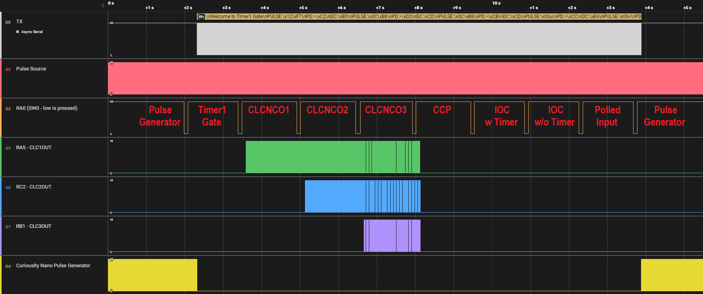

For more in-depth information on each of the measurement methods, please refer to the linked application note at the top of this example.

## Summary

This example has demonstrated sevreral methods of how to measure the pulse width and duty cycle of a pulse on the PIC18F18076 Curiousity Nano Board. 

<!--Note: A second Curiosty Nano Board was used to simulate the input signal at varying duty cycles (10%-90% at 10% intervals).  Replacing the pulse generating Curiosty Nano Board with a different input pulse generator may be advantageous depending on the application. -->

